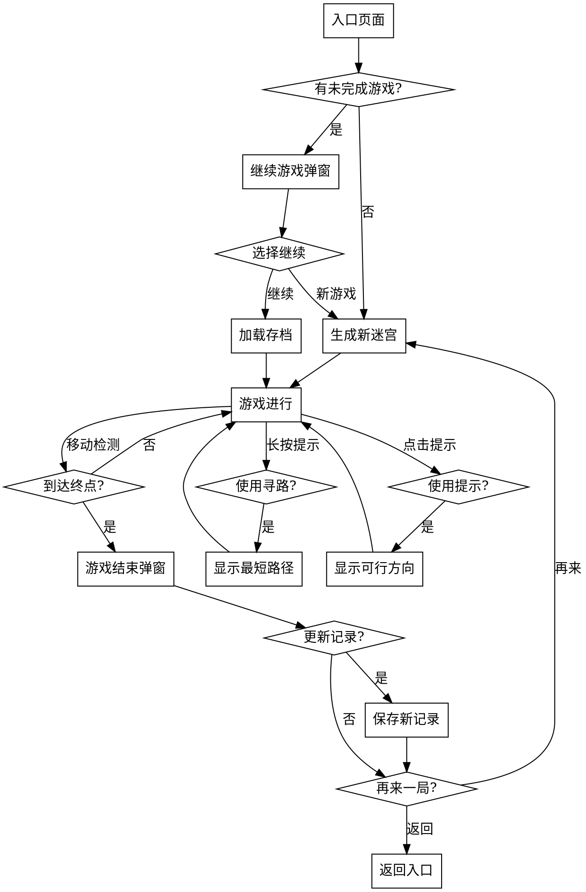

# 迷宫游戏设计文档

## 1. 概述

| 属性 | 内容 |
|------|------|
| **工具名称** | 迷宫 (Maze) |
| **分类** | 游戏 (Game) |
| **主要平台** | 移动端（Android/iOS） |
| **版本** | 1.0.0 |

## 2. 功能需求

### 2.1 迷宫生成

- 使用 Prim 算法生成随机迷宫
- 支持 10×10 到 100×100 连续可调的迷宫大小
- 起点固定在左上角 (1, 1)
- 终点固定在右下角 (cols-2, rows-2)
- 确保起点到终点有且仅有一条有效路径

### 2.2 操作方式

**滑动操作（类似游戏摇杆）**
- 手指在屏幕任意位置按住并滑动
- 根据滑动方向向量判断主方向（上/下/左/右）
- 持续向该方向移动（每 150-200ms 移动一格）
- 滑动改变方向时无缝切换移动方向
- 松开手指停止移动

**虚拟方向按键**
- 十字排列的 4 个方向按钮（上/下/左/右）
- 点击按钮移动一格
- 长按按钮持续移动（同滑动逻辑）
- 按钮样式：半透明背景，按下时高亮

### 2.3 游戏记录

**当前游戏进度**
- 保存未完成的迷宫状态
- 进入游戏时询问是否继续上次游戏

**最佳通关记录**
- 按难度范围分组记录：
  - 简单 (10-25)：最佳时间 + 日期
  - 中等 (26-50)：最佳时间 + 日期
  - 困难 (51-100)：最佳时间 + 日期
- 每次通关后比较并更新记录

### 2.4 增强功能

**提示功能**
- 点击提示按钮高亮显示当前位置下一步可行方向（闪烁提示）
- 再次点击取消提示

**自动寻路提示**
- 长按提示按钮 1 秒
- 使用 BFS 算法计算当前位置到终点的最短路径
- 用半透明绿色高亮显示完整路径
- 移动后自动清除高亮

**主题配色**
- 默认主题：参考贪吃蛇风格
- 可选主题：
  - 经典：黑墙白地
  - 深色：暗灰墙深蓝地
  - 清新：浅绿墙浅粉地

## 3. 界面设计

### 3.1 入口页面

```
┌─────────────────────────────┐
│  ←  迷宫                    │  ← AppBar
├─────────────────────────────┤
│                             │
│    ┌─────────────────┐      │
│    │                 │      │
│    │   🧭 迷宫图标   │      │  ← 大游戏图标
│    │                 │      │
│    └─────────────────┘      │
│                             │
│        迷宫大小: 30×30      │
│  ◀───────────────▶         │  ← 难度滑块
│      10                  100 │
│                             │
│      [ 开始游戏 ]           │  ← 开始按钮
│                             │
│  ┌───────────────────────┐  │
│  │ 最佳记录              │  │
│  │ 简单: 00:45 (2026-04-14)││
│  │ 中等: 02:30 (2026-04-13)││
│  │ 困难: --:--             │  │
│  └───────────────────────┘  │
│                             │
└─────────────────────────────┘
```

### 3.2 游戏页面

```
┌─────────────────────────────┐
│  ←  迷宫        💡  🔄    │  ← AppBar: 提示/重新开始
├─────────────────────────────┤
│  用时: 01:23   步数: 156   │  ← 状态栏
├─────────────────────────────┤
│                             │
│  ┌───────────────────────┐  │
│  │ █████████████████████ │  │
│  │ █ ○                 █ │  │
│  │ █ ███ █████ ███████ █ │  │
│  │ █   █ █   █ █     █ █ │  │  ← 迷宫画布
│  │ ███ █ █ ███ █ ███ █ █ │  │     (可滚动/缩放)
│  │ █   █ █   █ █ █ █ █ █ │  │
│  │ █ ███ █████ █ █ ███ █ │  │
│  │ █               ●   █ │  │
│  │ █████████████████████ │  │
│  └───────────────────────┘  │
│                             │
│         ┌───┐               │
│         │ ↑ │               │
│      ┌───┴───┴───┐          │  ← 虚拟方向按键
│      │ ←       → │          │
│      └───┬───┬───┘          │
│         │ ↓ │               │
│         └───┘               │
│                             │
└─────────────────────────────┘
```

### 3.3 游戏结束弹窗

```
┌─────────────────────────┐
│       🎉 恭喜通关！       │
│                         │
│    迷宫大小: 30×30       │
│    用时: 01:23           │
│    步数: 156             │
│                         │
│  [ 新纪录！]              │  ← 仅打破记录时显示
│                         │
│  [ 再来一局 ]  [ 返回 ]   │
└─────────────────────────┘
```

### 3.4 继续游戏弹窗

```
┌─────────────────────────┐
│      发现未完成游戏       │
│                         │
│    迷宫大小: 30×30       │
│    当前进度: 50%          │
│                         │
│  [ 继续游戏 ]  [ 新游戏 ] │
└─────────────────────────┘
```

### 3.5 视觉风格

- **整体风格**：参考贪吃蛇的 Material Design 风格
- **墙壁**：深灰色线条（宽 2dp）
- **通道**：白色背景
- **起点**：绿色圆形标记
- **终点**：红色圆形标记
- **玩家**：蓝色圆点（比格子小一点）
- **走过的路径**：极淡的蓝色半透明背景
- **最短路径提示**：半透明绿色高亮

## 4. 交互设计

### 4.1 移动规则

- 向某个方向移动前检查该方向是否有墙
- 有墙则不移动
- 无墙则移动一格并更新状态
- 到达终点时游戏结束

### 4.2 游戏流程



## 5. 技术架构

### 5.1 文件结构

```
app/lib/tools/maze/
├── maze_tool.dart              # 工具注册入口
├── maze_page.dart              # 入口页面（难度选择、记录）
├── maze_game_page.dart         # 游戏页面
├── maze_logic.dart             # 游戏逻辑
├── maze_generator.dart         # Prim 算法生成器
├── maze_models.dart            # 数据模型
├── maze_storage.dart           # 本地存储
├── maze_themes.dart            # 主题配色
└── widgets/
    ├── maze_board.dart         # 迷宫画布
    └── virtual_joystick.dart   # 虚拟方向按键
```

### 5.2 数据模型

```dart
/// 迷宫格子
class MazeCell {
  final int row, col;
  bool topWall = true;
  bool bottomWall = true;
  bool leftWall = true;
  bool rightWall = true;
  bool isStart = false;
  bool isEnd = false;
  bool isVisited = false;
  bool isOnPath = false; // 是否在最短路径上
}

/// 移动方向
enum Direction { up, down, left, right }

/// 难度等级
enum DifficultyLevel {
  easy(10, 25),
  medium(26, 50),
  hard(51, 100);

  final int minSize;
  final int maxSize;
  const DifficultyLevel(this.minSize, this.maxSize);
}

/// 最佳记录
class BestRecord {
  final DifficultyLevel level;
  final Duration bestTime;
  final DateTime date;
}

/// 游戏状态
class MazeState {
  final int rows, cols;
  final List<List<MazeCell>> cells;
  final int seed; // 用于重现迷宫

  int playerRow, playerCol;
  bool isGameOver = false;
  int moveCount = 0;
  Duration elapsed = Duration.zero;
  DateTime? startTime;

  bool showHint = false;
  bool showPath = false;
}

/// 存档状态
class MazeSaveState {
  final int rows, cols;
  final int seed;
  final int playerRow, playerCol;
  final List<List<bool>> visitedCells;
  final Duration elapsed;
  final int moveCount;
  final DateTime savedAt;
}
```

### 5.3 Prim 迷宫生成算法

```dart
class MazeGenerator {
  static List<List<MazeCell>> generate(int rows, int cols, {int? seed}) {
    final random = Random(seed ?? DateTime.now().millisecondsSinceEpoch);

    // 初始化所有格子都有墙
    final cells = List.generate(rows, (row) =>
      List.generate(cols, (col) => MazeCell(row, col)));

    // 设置起点和终点
    cells[1][1].isStart = true;
    cells[rows - 2][cols - 2].isEnd = true;

    // Prim 算法
    final visited = <MazeCell>[];
    final walls = <_Wall>[];

    // 从起点开始
    final startCell = cells[1][1];
    startCell.topWall = false; // 打开起点上墙
    visited.add(startCell);

    // 添加起点的墙到列表
    _addWalls(startCell, walls, cells, rows, cols);

    while (walls.isNotEmpty) {
      // 随机选择一面墙
      final wallIndex = random.nextInt(walls.length);
      final wall = walls.removeAt(wallIndex);

      final cell1 = wall.cell;
      final cell2 = wall.adjacentCell;

      if (!visited.contains(cell2)) {
        // 拆除墙
        _removeWall(cell1, cell2, wall.direction);

        visited.add(cell2);
        _addWalls(cell2, walls, cells, rows, cols);
      }
    }

    // 打开终点下墙
    cells[rows - 2][cols - 2].bottomWall = false;

    return cells;
  }

  static void _addWalls(MazeCell cell, List<_Wall> walls,
      List<List<MazeCell>> cells, int rows, int cols) {
    // 检查四个方向的相邻格子
    final directions = [
      (Direction.up, -1, 0),
      (Direction.down, 1, 0),
      (Direction.left, 0, -1),
      (Direction.right, 0, 1),
    ];

    for (final dir in directions) {
      final newRow = cell.row + dir.$2;
      final newCol = cell.col + dir.$3;

      if (newRow >= 0 && newRow < rows &&
          newCol >= 0 && newCol < cols) {
        walls.add(_Wall(cell, cells[newRow][newCol], dir.$1));
      }
    }
  }

  static void _removeWall(MazeCell cell1, MazeCell cell2, Direction direction) {
    switch (direction) {
      case Direction.up:
        cell1.topWall = false;
        cell2.bottomWall = false;
        break;
      case Direction.down:
        cell1.bottomWall = false;
        cell2.topWall = false;
        break;
      case Direction.left:
        cell1.leftWall = false;
        cell2.rightWall = false;
        break;
      case Direction.right:
        cell1.rightWall = false;
        cell2.leftWall = false;
        break;
    }
  }
}

class _Wall {
  final MazeCell cell;
  final MazeCell adjacentCell;
  final Direction direction;
  _Wall(this.cell, this.adjacentCell, this.direction);
}
```

### 5.4 BFS 最短路径算法

```dart
class PathFinder {
  static List<Offset>? findPath(List<List<MazeCell>> cells,
      int startRow, int startCol, int endRow, int endCol) {
    final rows = cells.length;
    final cols = cells[0].length;

    final visited = List.generate(rows, (_) => List.filled(cols, false));
    final parent = List.generate(rows, (_) =>
      List.generate(cols, (_) => const Offset(-1, -1)));

    final queue = Queue<Offset>();
    queue.add(Offset(startCol.toDouble(), startRow.toDouble()));
    visited[startRow][startCol] = true;

    final directions = [
      (Direction.up, -1, 0),
      (Direction.down, 1, 0),
      (Direction.left, 0, -1),
      (Direction.right, 0, 1),
    ];

    while (queue.isNotEmpty) {
      final current = queue.removeFirst();
      final col = current.dx.toInt();
      final row = current.dy.toInt();

      if (row == endRow && col == endCol) {
        // 重建路径
        final path = <Offset>[];
        var r = endRow, c = endCol;
        while (r != -1 && c != -1) {
          path.add(Offset(c.toDouble(), r.toDouble()));
          final p = parent[r][c];
          r = p.dy.toInt();
          c = p.dx.toInt();
        }
        return path.reversed.toList();
      }

      final cell = cells[row][col];
      for (final dir in directions) {
        final newRow = row + dir.$2;
        final newCol = col + dir.$3;

        // 检查是否可以移动到该方向
        if (!_canMove(cell, dir.$1)) continue;
        if (newRow < 0 || newRow >= rows) continue;
        if (newCol < 0 || newCol >= cols) continue;
        if (visited[newRow][newCol]) continue;

        visited[newRow][newCol] = true;
        parent[newRow][newCol] = Offset(col.toDouble(), row.toDouble());
        queue.add(Offset(newCol.toDouble(), newRow.toDouble()));
      }
    }

    return null;
  }

  static bool _canMove(MazeCell cell, Direction direction) {
    switch (direction) {
      case Direction.up:
        return !cell.topWall;
      case Direction.down:
        return !cell.bottomWall;
      case Direction.left:
        return !cell.leftWall;
      case Direction.right:
        return !cell.rightWall;
    }
  }
}
```

### 5.5 持续移动控制

```dart
class ContinuousMovementController {
  Timer? _moveTimer;
  Direction? _currentDirection;
  VoidCallback? onMove;

  static const _moveInterval = Duration(milliseconds: 180);

  void start(Direction direction, VoidCallback moveCallback) {
    _currentDirection = direction;
    onMove = moveCallback;
    _moveTimer?.cancel();
    _moveTimer = Timer.periodic(_moveInterval, (_) {
      onMove?.call();
    });
    // 立即执行一次
    onMove?.call();
  }

  void updateDirection(Direction direction) {
    if (_currentDirection != direction) {
      _currentDirection = direction;
    }
  }

  void stop() {
    _moveTimer?.cancel();
    _moveTimer = null;
    _currentDirection = null;
    onMove = null;
  }

  Direction? get currentDirection => _currentDirection;
  bool get isMoving => _moveTimer != null;
}
```

### 5.6 数据存储

使用 SharedPreferences 存储：

```dart
class MazeStorage {
  static const _currentStateKey = 'maze_current_state';
  static const _bestRecordsKey = 'maze_best_records';
  static const _selectedThemeKey = 'maze_selected_theme';

  // 存档状态
  Future<void> saveState(MazeSaveState state) async {
    final prefs = await SharedPreferences.getInstance();
    final json = state.toJson();
    await prefs.setString(_currentStateKey, jsonEncode(json));
  }

  Future<MazeSaveState?> loadState() async {
    final prefs = await SharedPreferences.getInstance();
    final jsonString = prefs.getString(_currentStateKey);
    if (jsonString == null) return null;
    final json = jsonDecode(jsonString) as Map<String, dynamic>;
    return MazeSaveState.fromJson(json);
  }

  Future<void> clearState() async {
    final prefs = await SharedPreferences.getInstance();
    await prefs.remove(_currentStateKey);
  }

  // 最佳记录
  Future<List<BestRecord>> loadBestRecords() async {
    final prefs = await SharedPreferences.getInstance();
    final jsonString = prefs.getString(_bestRecordsKey);
    if (jsonString == null) return [];
    final jsonList = jsonDecode(jsonString) as List;
    return jsonList.map((json) => BestRecord.fromJson(json)).toList();
  }

  Future<void> saveBestRecords(List<BestRecord> records) async {
    final prefs = await SharedPreferences.getInstance();
    final jsonList = records.map((r) => r.toJson()).toList();
    await prefs.setString(_bestRecordsKey, jsonEncode(jsonList));
  }

  // 主题
  Future<MazeTheme> loadTheme() async {
    final prefs = await SharedPreferences.getInstance();
    final themeName = prefs.getString(_selectedThemeKey);
    return MazeTheme.values.firstWhere(
      (t) => t.name == themeName,
      orElse: () => MazeTheme.defaultTheme,
    );
  }

  Future<void> saveTheme(MazeTheme theme) async {
    final prefs = await SharedPreferences.getInstance();
    await prefs.setString(_selectedThemeKey, theme.name);
  }
}
```

## 6. 性能考虑

### 6.1 迷宫生成优化

- 生成大迷宫（100×100）时使用 compute 在后台 isolate 执行
- 使用种子重现迷宫，避免保存完整迷宫数据
- 按需生成，不在内存中保留多个迷宫实例

### 6.2 渲染优化

- 使用 CustomPainter 绘制迷宫
- 仅绘制可视区域内的格子（结合 InteractiveViewer 的视口）
- 走过的路径标记使用增量更新，不重绘整个迷宫
- 大迷宫使用分层绘制，先画墙再画路径最后画玩家

### 6.3 手势处理优化

- 使用 GestureDetector 的 onPanStart/onPanUpdate/onPanEnd
- 计算主方向时使用阈值（水平/垂直偏移差 > 10px 才判定）
- 避免在手势回调中执行重计算，仅更新状态

## 7. 测试要点

### 7.1 功能测试

- [ ] 入口页面显示难度滑块和最佳记录
- [ ] 生成 10×10 到 100×100 的随机迷宫
- [ ] Prim 算法生成的迷宫有且仅有一条有效路径
- [ ] 迷宫可滚动缩放，适合大屏幕
- [ ] 滑动操作支持持续移动、无缝切换方向
- [ ] 虚拟方向按键支持点击和长按
- [ ] 走过的路径半透明显示
- [ ] 提示功能显示可行方向
- [ ] 自动寻路显示最短路径
- [ ] 保存当前游戏进度
- [ ] 加载并继续上次游戏
- [ ] 记录并显示最佳通关时间
- [ ] 多个主题配色可选

### 7.2 边界测试

- [ ] 最小迷宫（10×10）生成和游玩
- [ ] 最大迷宫（100×100）生成和游玩
- [ ] 迷宫边缘格子的墙绘制
- [ ] 撞墙时不移动
- [ ] 快速切换方向时的稳定性
- [ ] 长时间持续移动的内存占用

### 7.3 性能测试

- [ ] 100×100 迷宫生成时间 < 1s
- [ ] 100×100 迷宫滚动帧率保持 60fps
- [ ] BFS 寻路 100×100 迷宫 < 200ms
- [ ] 长时间游戏无内存泄漏

## 8. 后续扩展

### 8.1 可能的功能扩展

- 多人对战模式（比赛谁先到达终点）
- 限时挑战模式
- 收集道具/金币
- 多种迷宫生成算法（递归回溯、Kruskal、Eller）
- 成就系统
- 自定义主题颜色
- 分享迷宫给好友

### 8.2 预留接口

- `MazeGenerator` 支持多种算法切换
- `MazeTheme` 支持扩展主题
- `PathFinder` 支持多种寻路算法
- 存档状态支持序列化/反序列化

---

**文档版本**：1.0
**创建日期**：2026-04-14
**状态**：待实现
